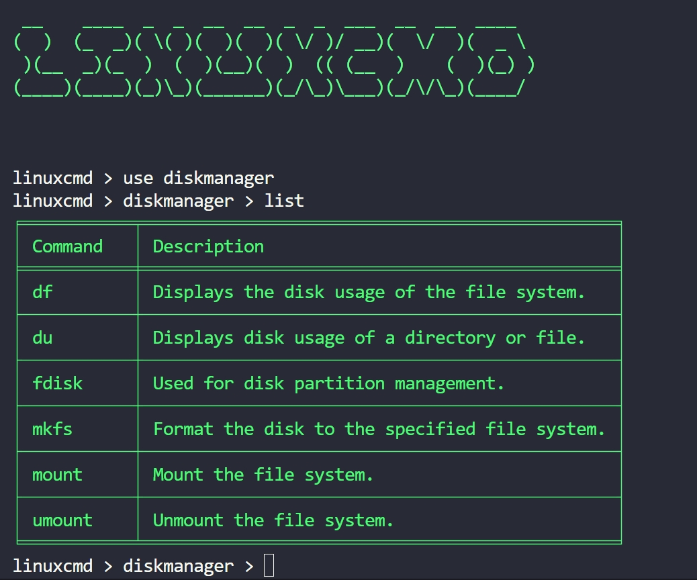

# linuxcmd
The purpose of linuxcmd is to help Linux developers to quickly find the Linux commands they need to use. Linuxcmd classifies all Linux commands, and users can search by category and view help documents at the same time. I will continue to add commands later.

# screenshot


# Usage
```sh
python3.8 -m linuxcmd.linuxcmd
linuxcmd > help
linuxcmd > use filemanager
linuxcmd > filemanager > list
linuxcmd > filemanager > info sed
```

